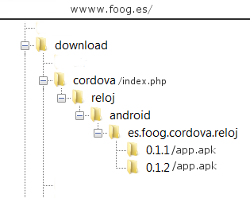

### Documentación.

### Reloj calendario

----


**Reloj calendario**, es una aplicación de código abierto para dispositivos *móviles*. Programada con **HTML 5** , **CSS3**, **Javascript** (jQuery - jQuery Mobile) y el marco de desarrollo multiplataforma **Apache CORDOVA**&#8482;.

##### HTML5 

Con **jQuery Mobile** y algunas de las propuestas de esta interfaz 

(archivos, www/**index.html**, www/**html/licencia.html**, y www/**html/calendario.html**).

Páginas (**page**) múltiples: **index.html** contiene **dos** páginas : ***#index*** (principal, con el lienzo -**canvas**- del reloj) y ***#ajustes***, con un conjunto de elementos desplegables (**collapsible**). 

Panel lateral (**panel**), con el menú de opciones de configuración e información.

Listas (**listview**). Cuadrículas (**grid**) y tablas (**table**).

Ventanas emergentes (**popup**), de los tipos: descartable, no descartable y modal.

Botones tipo, "ancla" (*anchor*) , botón (**button**), seleccionables: **radio** y **flipswitch**. 

Iconos (**icon**) incorporados en la interfaz y otros personalizados.

Barra de desplazamiento o progreso con **range**. Efectos de transición (**transition**) y **scroll**, etc. 

##### CSS3 

Con **jQuery Mobile** (**jquery.mobile-1.4.5.css**).

El archivo www/**css/index-comentado.css** contiene la "**hoja de estilos**", de la aplicación. Con identificadores, clases propias, clases de **jQuery Mobile** personalizadas y algunos recursos y código de otros autores. (www/**css/index-min.css**, es la versión reducida de este archivo - comprimido con  [YUI Compressor](http://yui.github.io/yuicompressor/) -).   

##### JAVASCRIPT

Con **jQuery** y **jQuery Mobile** (**jquery-1.11.3.js - jquery.mobile-1.4.5.js**).

El archivo www/**js/index-comentado.js** contiene la programación **Javascript** (la versión reducida www/**js/index-min.js** se obtiene con [Google Closure Compiler](https://developers.google.com/closure/compiler/))  y está estructurado de este modo:

```javascript
/* Enunciado y origen de dependencias */

/* Algunas digresiones con jQuery y Javascript prototype: */
jQuery.fn.center = function () {
	... ;
};

String.prototype.capitalizarPrimeraLetra = function(){
	... ;
}
//

/* Objeto 'programa', variables y funciones de propósito general: */
var programa = {
	... ,
	... ,
	actualizaciones : { // Ver (1)
	... ,
	...
	
	}	
 };
 
/* 
 * Objeto 'dispositivo', variables, funciones y escucha de eventos
 * con dependencia de CORDOVA nativo y CORDOVA complementos (plugins):
 */
var dispositivo = {
	...,
	...
};
//

/* Tareas en el inicio y escucha de eventos generales: */  
$(document).on("pagecreate","#index",function(evento){
	... ;
	... ;
});
	
``` 

Incluye código de otros autores y algunas propuestas publicadas en [Stack Overflow](http://stackoverflow.com/ "Stack Overflow").

**(1) Actualizaciones en Reloj calendario 0.1.x ...** 

Esta es una aplicación experimental fuera de los circuitos de distribución comerciales (Google Play Store, App Store, etc) e incorpora un sistema de actualizaciones (*back-end*) vía internet. A petición del usuario y siempre con una conexión Wi-Fi (para evitar consumo innecesario de datos) consigue, en el mejor de los casos:

1. **Comprobar** - Si existen existen versiones disponibles, superiores a la instalada.

2. **Descargar** - (Con los plugins,***cordova-plugin-file*** y ***cordova-plugin-file-transfer***) - El archivo (**.apk**, si Android) con la nueva versión, que guarda en el almacén temporal (público) del dispositivo.

3. **Instalar** - El paquete descargado (con la nueva versión)  mediante el *plugin* ***com.borismus.webintent***.

4.  **Limpiar**- De forma automática el paquete descargado (residual) que ha procurado la instalación de la nueva versión.

Las nuevas versiones empaquetadas, están almacenadas en una sección de un alojamiento web privado, con la siguiente estructura:



Una carpeta **cordova/** que contiene un guión (*script*)  **PHP**, **index.php (2)** y 
**otra carpeta con el nombre de la aplicación** (reloj/):

&nbsp;&nbsp;&nbsp;&nbsp;**reloj/** Contiene a su vez otra u otras carpetas, con el nombre de la plataforma,

&nbsp;&nbsp;&nbsp;&nbsp;(android/):
	
&nbsp;&nbsp;&nbsp;&nbsp;&nbsp;&nbsp;&nbsp;&nbsp;&nbsp;**android/** Con una carpeta con el mismo nombre que el del identificador (*packageName*)

&nbsp;&nbsp;&nbsp;&nbsp;&nbsp;&nbsp;&nbsp;&nbsp;&nbsp;de la aplicación (es.foog.cordova.reloj/):
	
&nbsp;&nbsp;&nbsp;&nbsp;&nbsp;&nbsp;&nbsp;&nbsp;&nbsp;&nbsp;&nbsp;&nbsp;**es.foog.cordoba.reloj/** Dispone de tantas carpetas como versiones de la aplicación hay disponibles.

&nbsp;&nbsp;&nbsp;&nbsp;&nbsp;&nbsp;&nbsp;&nbsp;&nbsp;&nbsp;&nbsp;&nbsp;El nombre de estas carpetas -numeral- (0.1.1/, 0.1.2/ ..etc), se corresponde exactamente

&nbsp;&nbsp;&nbsp;&nbsp;&nbsp;&nbsp;&nbsp;&nbsp;&nbsp;&nbsp;&nbsp;&nbsp;con el número de la versión de la aplicación cuyo paquete de instalación está incluido en ella:
			
&nbsp;&nbsp;&nbsp;&nbsp;&nbsp;&nbsp;&nbsp;&nbsp;&nbsp;&nbsp;&nbsp;&nbsp;&nbsp;&nbsp;&nbsp;&nbsp;**0.1.1/** app.apk
			
&nbsp;&nbsp;&nbsp;&nbsp;&nbsp;&nbsp;&nbsp;&nbsp;&nbsp;&nbsp;&nbsp;&nbsp;&nbsp;&nbsp;&nbsp;&nbsp;**0.1.2/** app.apk
			 

**(2) Código del archivo 'index.php':**
 			 
``` php
<?php
error_reporting(0);

/* Variables de entrada (con la petición): */
$versionesCorriente = (isset($_REQUEST["versionesCorriente"])) ? $_REQUEST["versionesCorriente"] : NULL ;
$nombre = (isset($_REQUEST["nombre"])) ? $_REQUEST["nombre"] : NULL;
$identificador = (isset($_REQUEST["paquete"])) ? $_REQUEST["paquete"] : NULL;
$plataforma = (isset($_REQUEST["plataforma"])) ? $_REQUEST["plataforma"] : NULL;
$serie = (isset($_REQUEST["serie"])) ? $_REQUEST["serie"] : NULL;

/* Series asignadas a las aplicaciones por el autor (registrada en el archivo 'www/xml/reloj.xml'). */
$series = array("562Q-A2K3-Y3Z3", /* etc...*/);

/* Asignación inicial del resto de variables: */
$error = false;
$errorMensaje = NULL;
$clave = NULL;
$resultado = false;
$estreno = false;
$versionesNueva = NULL;
$rutaRelativa = NULL;
$rutaRelativaVersionesNueva = NULL;
$rutaAbsolutaVersionesNueva = NULL;
$versionesDisponibles = false;
$nombreArchivo = NULL;
$sufijo = NULL;
$fechaModiArchivo = NULL;
$peso = 0;

/* Comprueba si la petición contiene todos los datos necesarios, en caso contrario devuelve el error: "400 - Bad Request". */ 
if($versionesCorriente != NULL  && $nombre != NULL && $identificador != NULL && $plataforma != NULL && $serie != NULL ){	
	$clave = array_search($serie, $series); 	
	
	/* Determina el nombre del archivo a descargar en función del número de 'serie' en la petición y de la 'plataforma'. */
	if($clave === 0 ){
		$nombreArchivo = "android-debug";		
	}elseif($clave > 0){
		$nombreArchivo = "android-release";
	}else{
		$error = true;
		$errorMensaje = "403 - Forbidden";
	}
	
	/* Determina la extensión del archivo a descargar, en función de la 'plataforma'. */
	if($error == false){
		if($plataforma == "android"){
			$sufijo = ".apk";
		}else{
			$error = true;
			$errorMensaje = '400 - No versions available for "' . $plataforma . '" platform.';
		}
	}
	
	/* 
	* Monta la ruta relativa de la estructura, ordenando progresión descendente las carpetas nombradas
	* con el número de versión que contienen; el nombre de la carpeta de orden superior es igual al número
	* de versión disponible más elevado, que compara con el número de la versión corriente (en la petición).
        * Si no hay errores, determina la ruta 'absoluta' hasta el archivo interesado.
        */
	if($error == false){
		$rutaRelativa = getcwd() . "/" . $nombre . "/". $plataforma . "/" .  $identificador . "/" ;
		$versionesDisponibles = scandir($rutaRelativa, 1);
		if(file_exists ($rutaRelativa) == false || $versionesDisponibles == false){
			$error = true;
			$errorMensaje = "404 - No such file or directory.";
		}else{
			$versionesNueva = $versionesDisponibles[0]; 
			$rutaAbsolutaVersionesNueva = "http://" . $_SERVER["SERVER_NAME"] . $_SERVER["REQUEST_URI"] . $nombre . "/". $plataforma . "/" . 
									       $identificador . "/" . $versionesNueva . "/" . $nombreArchivo . $sufijo;
			$rutaRelativaVersionesNueva = $rutaRelativa . "/" . $versionesNueva . "/" . $nombreArchivo . $sufijo; 
			if(file_exists ($rutaRelativaVersionesNueva)){
				if(version_compare($versionesNueva, $versionesCorriente) == 1){
					$estreno = true;
					$peso = filesize($rutaRelativaVersionesNueva); // Tamaño del archivo en Bytes.
					$fechaModiArchivo = filemtime($rutaRelativaVersionesNueva); // (timestamp).
				}
			}else{
				$error = true;
				$errorMensaje = "404 - (" . $nombreArchivo.$sufijo . ") File not found.";				
			}
		}	
	}
	
}else{
	$error = true;	
	$errorMensaje = "400 - Bad Request";
}

if($error == false){
	$resultado = true;
}

$versiones = array(
	"nueva" => $versionesNueva,
	"corriente" => $versionesCorriente,
	"url" => $rutaAbsolutaVersionesNueva,
	"peso" => $peso,
	"fecha" => $fechaModiArchivo
);

$lanzamiento = array(
	"acierto" =>true,
	"resultado" => $resultado,
	"estreno" => $estreno,
	"versiones" => $versiones,
	"error" => $errorMensaje	
);

/*
* Objeto de notación JSON que tiene la forma siguiente:
* {"acierto":true, "resultado":true|false, "estreno":true|false,"versiones":{"nueva":"n.n.n"|null,"corriente":"x.x.x",
*  "url":"http://... /cordova/reloj/android/es.foog.cordova.reloj/n.n.n./android-debug.apk"|null,
*  "peso":(bytes)|null,"fecha":(timestamp)|null,"error":(mensaje de error)|null}
*/
$actualizacionesJSON = json_encode($lanzamiento);

/* Salida de 'index.php', devuelve el objeto (JSON) construido en el proceso : */
echo $actualizacionesJSON;
?>
```
El anterior *script* **PHP** procesa la petición del usario y devuelve un *objeto*, codificado **JSON**, que informa, si no hay errores, sobre la existencia de versiones de la aplicación y, en su caso, de la **ruta absoluta** hasta el paquete de instalación de la versión mas alta. 

Si bien la 'comprobación' y 'descarga' no causa problemas, la instalación de la nueva versión (vía **webintent**) se producirá sólo sí:

* No hay conflicto entre las firmas de la aplicación corriente y la nueva.

* El paquete de la nueva versión se ha almacenado en un lugar 'no privado' del dispositivo, como: '**externalCacheDirectory**', en **Android**.

* El sistema operativo del dispositivo es de una versión igual o superior a la de la **API mínima** con la que se ha compilado la nueva aplicación.

##### IMÁGENES

El directorio wwww/**res/** contiene las imágenes: **logo** de la aplicación y **pantallas** de bienvenida. En formato **.png** y el tamaño adecuado para cada posición y resolución del dispositivo, con **Android**.

La asociación de estas imágenes con la instalación y lanzamiento de la aplicación se consigue mediante el código de **config.xml**

(ver etiquetas `<icon src="..." />`, `<icon density=" ... " src=" ..." />` y `<splash density=" ... " src=" ... " />`).   


##### CORDOVA&#8482;.

**Herramientas para el desarrollo de una aplicación Android, con CORDOVA&#8482;.** 

- **Node.js**&#174;: 'Runtime'Javascript. [https://nodejs.org/](https://nodejs.org/ "Node.js").

- **Git** (cliente): Software de control de versiones. Necesario para la instalación de algunos complementos (plugins). [http://git-scm.com/](https://nodejs.org/ "Git (cliente)"), (por ejemplo).

- **Java Development Kit (JDK) 7** (o superior). Plataforma JAVA estándar, para desarrolladores. Con **Android Studio** es recomendable la instalación de la **versión 7**, que puedes obtener en, [http://www.oracle.com/technetwork/java/javase/downloads/](http://www.oracle.com/technetwork/java/javase/downloads/ "JDK").

- **Android Studio**: IDE para el desarrollo de aplicaciones Android. Sitio oficial,  [http://developer.android.com/intl/es/sdk/]( http://developer.android.com/intl/es/sdk/ "Android Studio"). Este manual en español: [SGOLIVER.NET](http://www.sgoliver.net/blog/curso-de-programacion-android/ "Curso de programación Android"), puede servir de gran ayuda para la instalación y puesta en marcha del entorno de desarrollo integrado **Android Studio**.

- **Apache CORDOVA** : Un marco de desarrollo de código abierto. Permite utilizar las tecnologías estándar web como **HTML5, CSS3 y JavaScript** para construir aplicaciones  multiplataforma, evitando el lenguaje de desarrollo nativo (**Java**, en **Android**) de cada uno de los sistemas operativos de muchos dispositivos móviles. Documentación (varios idiomas) en, [https://cordova.apache.org/](https://cordova.apache.org/ "Apache Cordova"). Instalación, vía **NPM** (gestor de paquetes de Node.js, desde la línea de comandos de una terminal) :

 ```
 $ npm install -g cordova
 ```
 
----

##### Desarrollo del Proyecto "Reloj" con Android y CORDOVA&#8482;.


*Se utiliza un (desmemoriado) PC con Windows 7 y su herramienta de línea de comandos CMD para el desarrollo de este ejemplo.*

* **Crear** nuestro proyecto. Nos situamos en el escritorio, por ejemplo, y aplicamos el comando:

	**cordova create** [directorio que contiene el proyecto] [identificador] [**nombre del proyecto**]

	```
	C:\Users\[usuario]\Desktop> cordova create reloj_calendario com.example.reloj Reloj
	```

* **Agregar** la **plataforma** elegida. Los recursos que presenta este proyecto están orientados y optimizados para **Android** y su funcionamiento se ha probado sólo en dispositivos con esta plataforma. Nos desplazamos hasta el directorio "**reloj_calendario**" y añadimos la plataforma, **Android** con el comando:
	
	**cordova platform add** [plataforma]
	
	```
	C:\Users\[usuario]\Desktop\reloj_calendario> cordova platform add android
	```
	**PARCHE CORDOVA**, para recoger el evento  "**menubutton**". En las últimas versiones de **Cordova CLI** se ha omitido la programación relacionada con la escucha de este evento (considerado obsoleto).
	
	Personalmente soy partidario de conservar esta cualidad para los dispositivos que áun presentan el "botón menú". Si queres añadir el *parche* (una vez agregada la plataforma y como paso previo a la compilación), sigue la propuesta de 'Sven Casimir', en:

	[https://issues.apache.org/jira/browse/CB-8921](https://issues.apache.org/jira/browse/CB-8921 "issues.apache.org")

	Observando (hay un error de redacción):
	
	Donde dice:
	
	"*Finally in CordovaLib/src/org/apache/cordova/__CoreAndroid.java__ line 357 (setButtonPlumbedToJs) add a case statement after the KEYCODE_MENU entry like this:*"

	Debe decir:

	"*Finally in CordovaLib/src/org/apache/cordova/**CordovaWebImpl.java** line 357 (setButtonPlumbedToJs) add a case statement after the KEYCODE_MENU entry like this:*"	
	
	**Nota:* Este *parche* se ha añadido a las versiones 1.0.x de la aplicación.

* **Comprobar** la marcha de la operación. Echa un vistazo al contenido del directorio "**reloj_calendario**", con nuestro incipiente proyecto, para analizar el sistema de archivos creado y el código de **config.xml** del que puedes modificar, en principio, los **valores** etiquetados con: *description* (descripción breve de la aplicación) y *author* (nombre, dirección de correo electrónico y de página web). Ahora, como este es un proyecto "precocinado":
	
	* Entra en su repositorio en **Github** : [https://github.com/fooghub/Reloj-Cordova-Ejemplo](https://github.com/fooghub/Reloj-Cordova-Ejemplo "Github Reloj-Cordova-Ejemplo")
	
	* Descarga el archivo **Reloj-Cordova-Ejemplo-master.zip** (pulsando en el botón **DOWNLOAD ZIP**).	
	
	* Extrae los archivos de **Reloj-Cordova-Ejemplo-master.zip**  (por ejemplo, en el escritorio). Observa que la estructura de archivos que contiene el directorio "**Reloj-Cordova-Ejemplo-master**" es igual a la de nuestro "**reloj_calendario**", salvo por los archivos **LICENSE.md** y **README.md**, que es sólo un resumen de este documento. Bien, ahora:
		
		1. **Reemplaza** el directorio **www** (raíz) de tu proyecto "**reloj_calendario**" por el directorio (con el mismo nombre) **www** contenido en **Reloj-Cordova-Ejemplo-master**. 
		
		2. Abre en un editor el archivo **config.xml** de "**Reloj-Cordova-Ejemplo-master**", **copia** todas las líneas de código incluidas desde la etiqueta

		`<content src="index.html" />` hasta la etiqueta de cierre `</widget>`.

		Abre también, **config.xml** de "**reloj_calendario**" y **pega** la copia obtenida entre las citadas etiquetas. 
		
		En tu proyecto "**reloj_calendario**". Entra en el directorio raíz,  **www/** y abre **en el navegador** el archivo **index.html**. Si todo ha ido bien, aparecerá un bonito **reloj** (pulsa sobre él para acceder al menú de opciones). Disponemos ya de la posibilidad de **depurar** el código HTML, CSS y Javascript de nuestra futura aplicación.
		
		**Nota:** Si en lugar de **crear** tu propio proyecto, quieres ahorrarte trabajo y **compilar directamente** el obtenido desde Github, **elimina** los archivos (orientativos) **README.md** que se encuentran en los directorios **platforms** y **plugins**, después añade la **plataforma** preferida ,los **plugins** (complementos) recomendados y efectúa la orden:		
		
		```
		C:\Users\[usuario]\Desktop\Reloj-Cordova-Ejemplo-master> cordova build
		```
	
* **Añadir complementos**. Para que nuestro proyecto tenga la misma funcionalidad que busca el original, conviene añadir los siguientes **plugins**, con el comando :

	**cordova plugin add** [plugin].   		
		
	* **cordova-plugin-device** : Define un objeto global ***device***, que describe el hardware y el software del dispositivo. No estará disponible hasta después de desencadenado el evento ***deviceready***. Documentación, [https://github.com/apache/cordova-plugin-device](https://github.com/apache/cordova-plugin-device "cordova-plugin-device "). Instalación:
	
	```
	C:\Users\[usuario]\Desktop\reloj_calendario> cordova plugin add cordova-plugin-device
	```				
	
	*  **cordova-plugin-splashscreen** : Muestra y oculta una pantalla de bienvenida durante la puesta en marcha de la aplicación. Documentación en, [https://github.com/apache/cordova-plugin-splashscreen](https://github.com/apache/cordova-plugin-splashscreen "cordova-plugin-splashscreen"). Instalación:
	
	```
	C:\Users\[usuario]\Desktop\reloj_calendario> cordova plugin add cordova-plugin-splashscreen
	``` 
	
	* **cordova-plugin-network-information** : Proporciona información acerca de la conexión telefónica y Wi-Fi del dispositivo y si.este dispone de una conexión a Internet. Documentación [https://github.com/apache/cordova-plugin-network-information](https://github.com/apache/cordova-plugin-network-information "cordova-plugin-network-information") e instalación:
	
	```
	C:\Users\[usuario]\Desktop\reloj_calendario> cordova plugin add cordova-plugin-network-information	
	```
	
	* **io.litehelpers.cordova.sqlite** : Interfaz nativa de **SQLite** en Cordova. La aplicación **Reloj** incorpora una pequeña base de datos local (**reloj.db**), situada en el directorio raíz para conservar los cambios de configuración realizados por el usuario. Documentación de este plugin en, [https://github.com/litehelpers/Cordova-sqlite-storage](https://github.com/litehelpers/Cordova-sqlite-storage "Cordova-sqlite-storage"). El código **Javascript** relacionado con este complemento está implementado para las versiones: **0.7.10** y **Cordova sqlite storage - free enterprise version**, instalación de este último:
	
	```
	C:\Users\[usuario]\Desktop\reloj_calendario> cordova plugin add https://github.com/litehelpers/Cordova-sqlite-enterprise-free
	```
	
	* **uk.co.whiteoctober.cordova.appversion** : Lee la versión de la aplicación y otras propiedades de las configuración inicial. Documentación en [https://github.com/whiteoctober/cordova-plugin-app-version](https://github.com/whiteoctober/cordova-plugin-app-version "cordova-plugin-app-version"), instalación:
	
	```
	C:\Users\[usuario]\Desktop\reloj_calendario> cordova plugin add cordova-plugin-app-version
	```
	
	* **com.darktalker.cordova.screenshot** : Permite a la aplicación tomar capturas de la pantalla actual y almacenar las imágenes en el dispositivo. Documentación en, [https://github.com/gitawego/cordova-screenshot](https://github.com/gitawego/cordova-screenshot "cordova-screenshot") e instalación (vía git):
	
	```
	C:\Users\[usuario]\Desktop\reloj_calendario> cordova plugin add https://github.com/gitawego/cordova-screenshot.git
	```
	
	* **cordova-plugin-nativeaudio** : Extensión para la reproducción de audio nativo. Documentación, [https://github.com/floatinghotpot/cordova-plugin-nativeaudio](https://github.com/floatinghotpot/cordova-plugin-nativeaudio "cordova-plugin-nativeaudio"), instalación:
	
	```
	C:\Users\[usuario]\Desktop\reloj_calendario> cordova plugin add cordova-plugin-nativeaudio
	```
	
	* **cordova-plugin-dialogs** : Proporciona acceso a algunos elementos de la interfaz de diálogo nativa a través de un objeto global ***navigator.notification***, que no estará disponible hasta después del evento  ***deviceready***. Documentación, [https://github.com/apache/cordova-plugin-dialogs](https://github.com/apache/cordova-plugin-dialogs "cordova-plugin-dialogs") e instalación:
	
	```
	C:\Users\[usuario]\Desktop\reloj_calendario> cordova plugin add cordova-plugin-dialogs
	```
	
	* **cordova-plugin-file** : Implementa una API que permite el acceso en el modo de lectura / escritura a los archivos que residen en el dispositivo. Documentación en, [https://github.com/apache/cordova-plugin-file](https://github.com/apache/cordova-plugin-file "cordova-plugin-file"). Instalación:
	
	```
	C:\Users\[usuario]\Desktop\reloj_calendario> cordova plugin add cordova-plugin-file
	```
	
	* **cordova-plugin-file-transfer** : Permite cargar y descargar archivos. Define los constructores globales de función, ***FileTransfer*** y ***FileUploadOptions***, disponibles después del evento ***deviceready***. Documentación en, [https://github.com/apache/cordova-plugin-file-transfer](https://github.com/apache/cordova-plugin-file-transfer "cordova-plugin-file-transfer") e instalación:
	
	```
	C:\Users\[usuario]\Desktop\reloj_calendario> cordova plugin add cordova-plugin-file-transfer
	```
	
	* **com.borismus.webintent** : Web Intent es un marco experimental para la comunicación entre aplicaciones. Este plugin se utiliza, entre otros usos, para abrir paquetes ***Android.apk***. Documentación, [https://github.com/Initsogar/cordova-webintent](https://github.com/Initsogar/cordova-webintent "cordova-webintent"). Instalación (git):
	
	```
	C:\Users\[usuario]\Desktop\reloj_calendario> cordova plugin add https://github.com/Initsogar/cordova-webintent.git 
	```	
	
	* **ionic-plugin-keyboard** : El objeto ***cordova.plugins.Keyboard*** ofrece funciones para hacer la interacción con el teclado más fácil, y desencadena eventos para indicar cuando el teclado virtual del dispositivo se abre / cierra. Documentación, [https://github.com/driftyco/ionic-plugin-keyboard](https://github.com/driftyco/ionic-plugin-keyboard "ionic-plugin-keyboard"). Instalación:
	
	```
	C:\Users\[usuario]\Desktop\reloj_calendario> cordova plugin add ionic-plugin-keyboard
	```
	
	* **cordova-plugin-battery-status** : Indica el estado de la batería (porcentaje disponible) y detecta, en su caso, si se está cargando. Documentación, [https://github.com/apache/cordova-plugin-battery-status](https://github.com/apache/cordova-plugin-battery-status "cordova-plugin-battery-status")  e instalación:
	
	```
	C:\Users\[usuario]\Desktop\reloj_calendario> cordova plugin add cordova-plugin-battery-status
	```
	* **uk.co.workingedge.phonegap.plugin.istablet** : Indica si el dispositivo (**Android** o **iOS**) es una "**tablet**". Documentación, [https://github.com/dpa99c/phonegap-istablet#readme](https://github.com/dpa99c/phonegap-istablet#readme "phonegap-istablet").Instalación:
	
	```
	C:\Users\[usuario]\Desktop\reloj_calendario> cordova plugin add uk.co.workingedge.phonegap.plugin.istablet
	```
	* **cordova-plugin-inappbrowser** : Proporciona una vista del navegador web que muestra con la llamada **cordova.InAppBrowser.open()**. Documentación: [https://github.com/apache/cordova-plugin-inappbrowser](https://github.com/apache/cordova-plugin-inappbrowser). Instalación :
	
	```
	C:\Users\[usuario]\Desktop\reloj_calendario> cordova plugin add cordova-plugin-inappbrowser
	```
	
	* ***cordova-plugin-whitelist*** : *Controla qué direcciones URL de la aplicación pueden solicitarse al sistema (para abrir). Por defecto, no se permiten las URL externas. Cordova añade automáticamente este plugin, en el momento de la creación del proyecto*.


* **Probar** nuestra aplicación. Si dispones de un ordenador con una **óptima capacidad RAM** y **Android Studio** convenientemente configurado, puedes **simular** el funcionamiento de la aplicación en el **emulador** con el comando: **cordova run android**.

	```
	C:\Users\[usuario]\Desktop\reloj_calendario> cordova run android  	
	```

* **Compilar** nuestra aplicación (modo **depuración**). Con el comando, **cordova build**, conseguimos el archivo **android-debug.apk**, (funcional e instalable) en el directorio de nuestro proyecto: `reloj_calendario\platforms\android\build\outputs\apk\android-debug.apk`. Un archivo con extensión **.apk** (Application Package File) es un paquete para el sistema operativo **Android**. Este formato es una variante del formato **JAR** de **Java**.  

	```
	C:\Users\[usuario]\Desktop\reloj_calendario> cordova build 	
	```
* **Firmar** nuestra aplicación. **Android** requiere que todas sus aplicaciones incorporen una clave privada o firma electrónica. Hay por lo menos dos métodos para esta práctica el siguiente, que creo más sencillo, consiste en:
		
	* Creamos el **almacén de claves** con la herramienta Java :  "**keytool**" (procura que entre las **variables de entorno** del equipo, la variable de sistema **Path** contenga la **ruta** hasta el directorio de **binarios** del Java JDK. En **Windows**, esta parte de la variable tendrá aproximadamente, esta apariencia : `C:\ ...;C:\Program Files\Java\jdk1.7.0_79\bin`), con el comando,

	**keytool -genkey -v -keystore *ejemplo*.keystore -alias *ejemplo* -keyalg RSA -keysize 2048 -validity 10000**.

	En nuestro ejercicio sería algo parecido a esto:
	
	```
	C:\Users\[usuario]\Desktop> keytool -genkey -v -keystore reloj.keystore -alias reloj_calendario -keyalg RSA -keysize 2048 -validity 10000	
	```
	
	* Una vez dispongamos de nuestro "almacén de claves", **reloj.keystore** que situamos temporalmente en el escritorio; creamos el archivo  **release-signing.properties** (con **Cordova 4.0.0** ó **superior**) dentro de nuestro proyecto, en la dirección `reloj_calendario\platforms\android\release-signing.properties`, con las siguientes líneas de texto:
	
	```
	storeFile=C:/Users/[usuario]/Desktop/reloj.keystore
	storeType=jks
	key.alias=reloj_calendario
	```

		
* **Compilar** nuestra aplicación (modo **lanzamiento**). Con el comando, **cordova build --release**, conseguimos el archivo **android-release.apk**, (si está firmado) en el directorio de nuestro proyecto: `reloj_calendario\platforms\android\build\outputs\apk\android-release.apk`. Si hemos incluido el archivo **release-signing.properties**, mencionado en el apartado anterior, **cordova** solicitará la **contraseña** para añadir la clave privada al paquete de distribución.   

	```
	C:\Users\[usuario]\Desktop\reloj_calendario> cordova build --release	
	```
	Con el comando (Java) **jarsigner** puedes comprobar o comparar las propiedades de la clave privada en los archivos **.apk**, firmados. En nuestro ejemplo:

	```
	C:\Users\[usuario]\Desktop\reloj_calendario\platforms\android\build\outputs\apk> jarsigner -verify android-release.apk -verbose -certs
	```

* **Distribuir** nuestra aplicación. Si tienes interés en el circuito comercial (**Google Play Store**, con **Android**), puedes dirigirte aquí: [Google Play para Desarrolladores](https://support.google.com/googleplay/android-developer/answer/6112435?hl=esal).
	
	Si compartes aplicaciones **Android** vía Internet o correo electrónico, **recuerda**: La opción de seguridad, "**Permitir la instalación de aplicaciones de origen desconocido**", debe permanecer seleccionada:
	
	```
	Ajustes > Seguridad > Orígenes desconocidos - (seleccionar: Permitir la instalación de aplicaciones de origen desconocido).
	```
		
	
Saludos.	
  	
-----------	

 2016 - Foog.Software

[www.foog.es](http://www.foog.es/)


